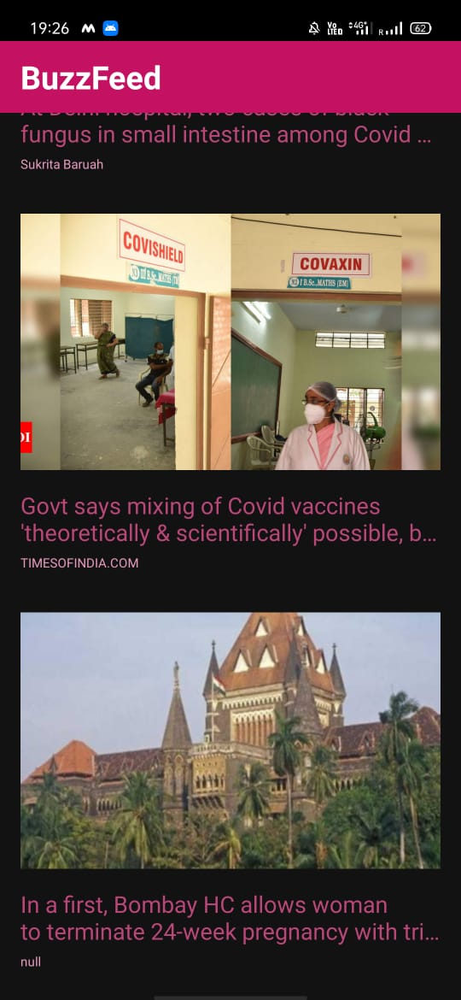
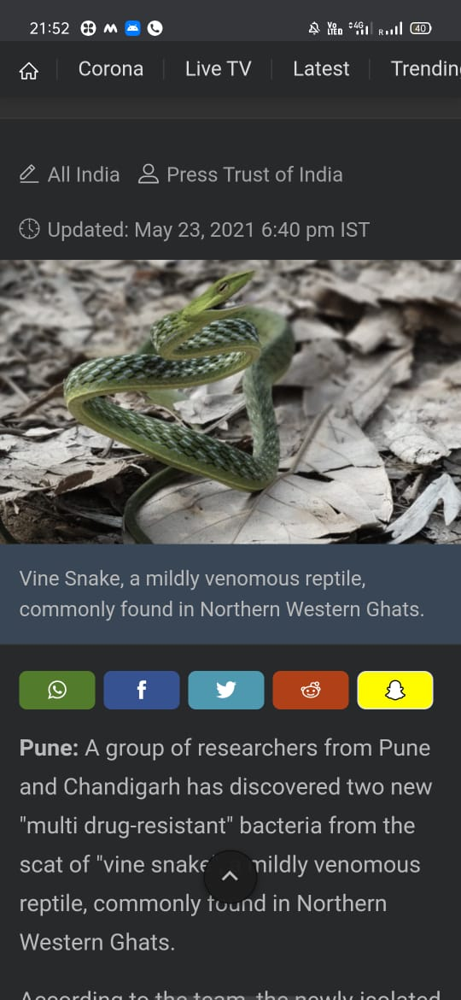
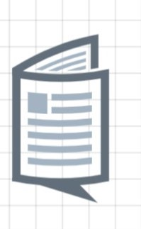

# BuzzFeed 

#### About
This Application is similar to google news that provides the user with latest news from around the world.
The news appear in the form of clickable cards. When user clicks on a particular headline card, the full story
apprears on the chrome tab.

#### Tools and Languages Required
<list>
  <ul>
    <li>Android Studio</li>
    <li>Kotlin</li>
    <li>xml</li>
    <li>recycler view</li>
    <li>Layout manager</li>
    <li>Adapter</li>
    <li>View Holder</li>
    <li>API</li>
  </ul>
  </list>
  

  
 

    

## Download 
       
Download the app by clicking here!! 
 

                  
## Connect on Linkedin
[Click here to check out my linkedin profile](https://www.linkedin.com/in/shreya-kumari-b9b5841a0/)
  
