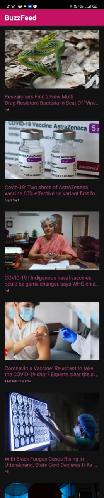

# BuzzFeed

#### About
This Application is similar to google news that provides the user with latest news from around the world.
The news appear in the form of clickable cards. When user clicks on a particular headline card, the full story
apprears on the chrome tab.

#### Tools and Languages Required
<list>
  <ul>
    <li>Android Studio</li>
    <li>Kotlin</li>
    <li>xml</li>
    <li>recycler view</li>
    <li>Layout manager</li>
    <li>Adapter</li>
    <li>View Holder</li>
    <li>API</li>
  </ul>
  </list>
  
  
   
  
  
